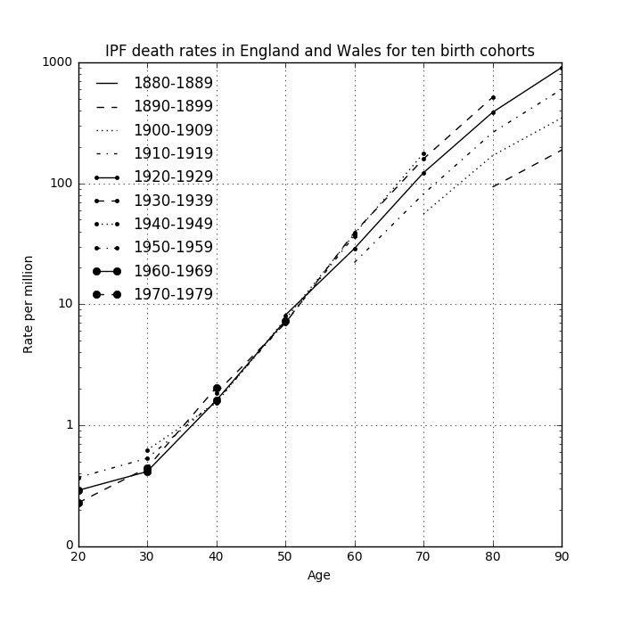

% ESA Presentation
% Dr Carl Reynolds 

# Is occupational asbestos exposure an under-recognised cause of IPF?

## Why the question arises

##

The question is not new. It arises because it is clinical plausible, epidemiologically plausible, and consistent with
fibre studies and existing case-control data.

## 

- clinical presentation can be similar
- radiologically and histopathologically both give rise to UIP - no differentiating biomarkers
- doctors may not elicit previous asbestos exposure and patients may not recall it; unclear what dose is needed

## 

- more common in men, manual workers, those living in industrial regions
- correlation with asbestos related disease, cohort effect
- correlation with asbestos imports

##

{ width=65% }

##

{ width=65% }

##

{ width=65% }

## Fibre studies and existing case-control data

## 

##

- 14 case-control studies to date 
- most use community controls and self-reported exposure measures; none quantify asbestos exposure
- occupational overlap with mesothelioma case-control studies e.g metal-plate workers

##

we carried out a meta-analysis of previous case-control studies; pooled PAF estimates by exposure category (VGDF, Metal, Wood, Agricultural dust) ranged from 4 to 14\% 

##

| Exposure          | Risk estimates (n) | Pooled OR (95% CI) | Pooled PAF (95% CI) |
|-------------------|--------------------|--------------------|---------------------|
| VGDF*             | 8                  | 1.6 (1.3-1.9)      | 14 (12-17)          |
| Metal dust        | 10                 | 1.4 (1.3-1.7)      | 8 (6-10)            |
| Wood dust         | 11                 | 1.7 (1.3-2.2)      | 4 (3-5)             |
| Agricultural dust | 6                  | 1.7 (1.2-2.3)      | 9 (6-12)            |

# Why the question matters

##

- it's bad to not know the cause of a killer disease that is becoming more common
- there is ongoing asbestos exposure globally (including the UK) 
- there is reason to think some IPF is due to asbestos, if this is the case we can better understand and prevent IPF

# What IPFJES is and why it's needed 

## 

- (another) hospital-based case-control study
- lifetime occupational histories combined with occupational proportionate mortality ratios for mesothelioma and a job-process based asbestos exposure assessment..
- blood test for susceptibility genetics to investigate gene-exposure interactions
- basically a telephone-interview + blood test for 920 patients at 16 centres
  
# 

##

- Funded by Wellcome Trust and in the NIHR portfolio. All regulatory approvals in place.
- Registered on [clinicaltrials.gov](https://clinicaltrials.gov/ct2/show/NCT03211507)
- Full study documentation online at [www.ipfjes.org](http://ipfjes.org/)

# Any questions?

##

- <carl.reynolds@imperial.ac.uk> 
- [drcjar](https://twitter.com/drcjar) | [ipfjes](https://twitter.com/ipfjes)
- [www.carlreynolds.net](http://carlreynolds.net/) | [www.ipfjes.org](http://ipfjes.org/)

